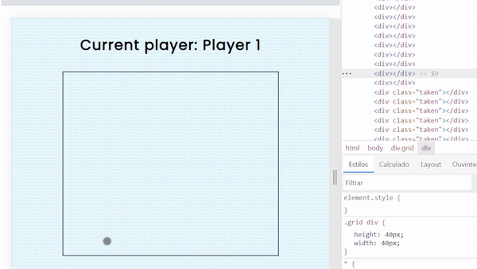

This is a simple connect four game made with vanilla JS, HTML and CSS
  

  
<em>I made this project following Ania Kubow's JS game guide and ended up adding a couple lines of code by myself to optimize it a little;
this was made solely for the purpose of practicing JavaScript. </em>
